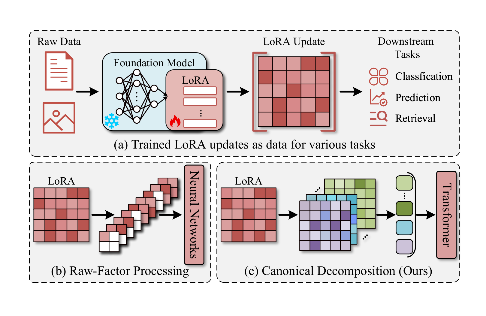
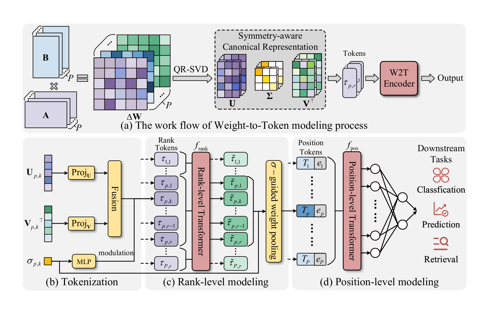

# W2T

<p align="center">
  <b>W2T: LoRA Weights Already Know What They Can Do</b>
</p>

<p align="center">
  Code for language and diffusion LoRA experiments in W2T.
</p>

<p align="center">
  
  
  
  
</p>

<p align="center">
  <a href="./llm/README.md">LLM Workflows</a>
  &middot;
  <a href="./diffusion/README.md">Diffusion Workflows</a>
</p>

<p align="center">
  
</p>

<p align="center">
  <sub>LoRA checkpoints already contain useful behavioral signals, but reading them reliably requires symmetry-aware modeling.</sub>
</p>

## [ Motivation ]

Large collections of LoRA checkpoints are easy to store and share, but they often come with incomplete metadata, limited training details, or no ready-to-run evaluation setup. In many cases, the weight file itself is the most reliable artifact left behind.

W2T starts from this practical question: can we infer what a LoRA does directly from its weights? Instead of probing every checkpoint through expensive model inference, W2T learns from LoRA weight space itself, enabling downstream tasks such as classification, performance prediction, and retrieval.

## [ W2T Pipeline ]

<p align="center">
  
</p>

<p align="center">
  <sub>W2T converts LoRA weights into canonical components, maps them into tokens, and learns a checkpoint-level representation for downstream tasks.</sub>
</p>

### [ At A Glance ]

1. `Canonicalize`  
   Apply symmetry-aware QR-SVD decomposition to convert raw LoRA factors into a stable representation.

2. `Tokenize`  
   Turn rank-wise components into structured tokens that preserve local LoRA geometry.

3. `Model`  
   Build checkpoint-level embeddings for tasks such as classification, prediction, and retrieval.

## [ Repository Overview ]

| Track | Scope | Main Tasks | Datasets |
| --- | --- | --- | --- |
| `llm/` | LoRA learning on Llama-3.2-3B | Classification, regression, retrieval | GoEmotions, ARC-Easy, ARC-Challenge, BoolQ, GSM8K, MBPP |
| `diffusion/` | LoRA learning on Stable Diffusion v1.4 | Attribute classification | CelebA, CUB |

```text
W2T_code/
  README.md
  assets/readme/
  llm/
  diffusion/
```

- `llm/` contains the language workflows.
- `diffusion/` contains the vision workflows.
- `assets/readme/` stores the paper figures used in this README.

## [ Setup ]

Install only the dependencies you need:

```bash
pip install -r llm/requirements.txt
pip install -r diffusion/requirements.txt
```

Some scripts download checkpoints from Hugging Face. Set `HF_TOKEN` if your model access requires it.

## [ Quick Start ]

<details open>
<summary><b>[ LLM ]</b></summary>

### GoEmotions Classification

```bash
cd llm
python classification/collect_goemotions_loras.py --output_dir ./classification/outputs/goemotions_loras --gpu_ids 0
python classification/merge_metadata.py --input_dir ./classification/outputs/goemotions_loras --output_csv ./classification/lora_label_info.csv
python classification/train_w2t_classifier.py --labels_csv ./classification/lora_label_info.csv --checkpoint_dir ./classification/checkpoints
```

### ARC-Easy Regression

```bash
cd llm
python regression/collect/make_plan.py --out-dir ./regression/plans
python regression/collect/run_plan.py --plan_dir ./regression/plans --runs_root ./outputs/regression/runs --results_csv ./outputs/regression/results_arc_easy.csv
python regression/perf_prediction_pipeline.py prepare --input-dir ./outputs/regression --glob "results_arc_easy*.csv" --output-dir ./outputs/regression/prepared
python regression/perf_prediction_pipeline.py cache --metadata-csv ./outputs/regression/prepared/all_metadata.csv --split-dir ./outputs/regression/prepared --output-dir ./outputs/regression/cache --representations w2t
python regression/perf_prediction_pipeline.py pack --manifest ./outputs/regression/cache/manifest.json --output-dir ./outputs/regression/cache_packed --pack-mode by_split --model-types w2t
python regression/perf_prediction_pipeline.py train --packed-cache-dir ./outputs/regression/cache_packed --output-dir ./outputs/regression/w2t_results --model-type w2t --target-col test_acc
```

### Retrieval

```bash
cd llm
python retrieval/collect/make_plan.py --out-dir ./retrieval/plans
python retrieval/collect/run_plan_ood.py --plan_dir ./retrieval/plans --plan_files "arc_challenge_gallery_plan.csv,boolq_gallery_plan.csv,gsm8k_gallery_plan.csv,mbpp_gallery_plan.csv" --runs_root ./outputs/retrieval/gallery_runs --results_dir ./outputs/retrieval/gallery_results
python retrieval/collect/make_fewshot_plan.py --out-dir ./outputs/retrieval/fewshot_plans
python retrieval/collect/run_plan_ood.py --plan_dir ./outputs/retrieval/fewshot_plans --plan_files "plan_fewshot_arc_challenge.csv,plan_fewshot_boolq.csv,plan_fewshot_gsm8k.csv,plan_fewshot_mbpp.csv" --runs_root ./outputs/retrieval/query_runs --results_dir ./outputs/retrieval/query_results
python retrieval/fewshot_retrieval.py prepare --gallery-csvs "./outputs/retrieval/gallery_results/results_arc_challenge.csv,./outputs/retrieval/gallery_results/results_boolq.csv,./outputs/retrieval/gallery_results/results_gsm8k.csv,./outputs/retrieval/gallery_results/results_mbpp.csv" --query-csvs "./outputs/retrieval/query_results/results_arc_challenge.csv,./outputs/retrieval/query_results/results_boolq.csv,./outputs/retrieval/query_results/results_gsm8k.csv,./outputs/retrieval/query_results/results_mbpp.csv" --output-dir ./outputs/retrieval/prepared --max-queries-per-dataset-shot 25
python retrieval/perf_prediction_pipeline.py cache --metadata-csv ./outputs/retrieval/prepared/all_metadata.csv --split-dir ./outputs/retrieval/prepared/splits --output-dir ./outputs/retrieval/cache --representations w2t
python retrieval/fewshot_retrieval.py retrieve --manifest ./outputs/retrieval/cache/manifest.json --metadata-csv ./outputs/retrieval/prepared/all_metadata.csv --trained-root ./outputs/regression/w2t_results --output-dir ./outputs/retrieval/results --model-type w2t
```

</details>

<details open>
<summary><b>[ Diffusion ]</b></summary>

### CelebA

```bash
cd diffusion
python data_prepare/split_celeba_identities.py --img_dir /path/to/img_align_celeba --identity_file /path/to/identity_CelebA.txt --out_root ./data_prepare/outputs/celeba_identities
python data_prepare/build_celeba_labels.py --celeb_root ./data_prepare/outputs/celeba_identities --attr_csv /path/to/list_attr_celeba.csv --out_pt ./data_prepare/outputs/celeba_labels.pt --out_csv ./data_prepare/outputs/celeba_labels.csv
python data_generation/make_plan.py --celeb_root ./data_prepare/outputs/celeba_identities --out_dir ./data_generation/plans
python data_generation/run_plan.py --plan_csv ./data_generation/plans/plan.csv --runs_root ./data_generation/outputs/celeba/models_rank8_full --results_csv ./data_generation/outputs/celeba/results.csv
python data_prepare/make_lora_split.py --lora_root ./data_generation/outputs/celeba/models_rank8_full --out_dir ./data_prepare/outputs/splits_celeba_rank8_full
python classification/cache_celeba_loras.py --lora_root ./data_generation/outputs/celeba/models_rank8_full --labels_csv ./data_prepare/outputs/celeba_labels.csv --out_path ./classification/cache/celeba_rank8_full.pt
python classification/train_w2t_celeba.py --lora_root ./data_generation/outputs/celeba/models_rank8_full --labels_csv ./data_prepare/outputs/celeba_labels.csv --split_dir ./data_prepare/outputs/splits_celeba_rank8_full --cache_path ./classification/cache/celeba_rank8_full.pt --checkpoint_dir ./classification/checkpoints
```

### CUB

```bash
cd diffusion
python data_prepare/split_cub_images.py --cub_root /path/to/CUB_200_2011 --out_root ./data_prepare/outputs/cub_instances
python data_prepare/build_cub_labels.py --cub_root /path/to/CUB_200_2011 --instance_root ./data_prepare/outputs/cub_instances --out_csv ./data_prepare/outputs/cub_labels.csv
python data_generation/make_cub_plan.py --instance_root ./data_prepare/outputs/cub_instances --out_dir ./data_generation/plans
python data_generation/run_plan.py --plan_csv ./data_generation/plans/cub_plan.csv --runs_root ./data_generation/outputs/cub/models_rank8_full --results_csv ./data_generation/outputs/cub/results.csv
python data_prepare/make_lora_split.py --lora_root ./data_generation/outputs/cub/models_rank8_full --out_dir ./data_prepare/outputs/splits_cub_rank8_full
python classification/cache_cub_loras.py --lora_root ./data_generation/outputs/cub/models_rank8_full --labels_csv ./data_prepare/outputs/cub_labels.csv --out_path ./classification/cache/cub_rank8_full.pt
python classification/train_w2t_cub.py --lora_root ./data_generation/outputs/cub/models_rank8_full --labels_csv ./data_prepare/outputs/cub_labels.csv --split_dir ./data_prepare/outputs/splits_cub_rank8_full --cache_path ./classification/cache/cub_rank8_full.pt --checkpoint_dir ./classification/checkpoints/cub
```

</details>


> [!NOTE]
> Datasets and trained checkpoints are not included in this repository.
> 
> See `llm/README.md` and `diffusion/README.md` for the task-specific entry points.
> 
> If you find this repository useful for your research, please consider citing our survey and starring this repository.

```bibtex
@article{han2026w2t,
  title   = {W2T: LoRA Weights Already Know What They Can Do},
  author  = {Han, Xiaolong and Neri, Ferrante and Jiang, Zijian and Wu, Fang and Ye, Yanfang and Yin, Lu and Wang, Zehong},
  journal = {arXiv preprint arXiv:2603.15990},
  year    = {2026}
}